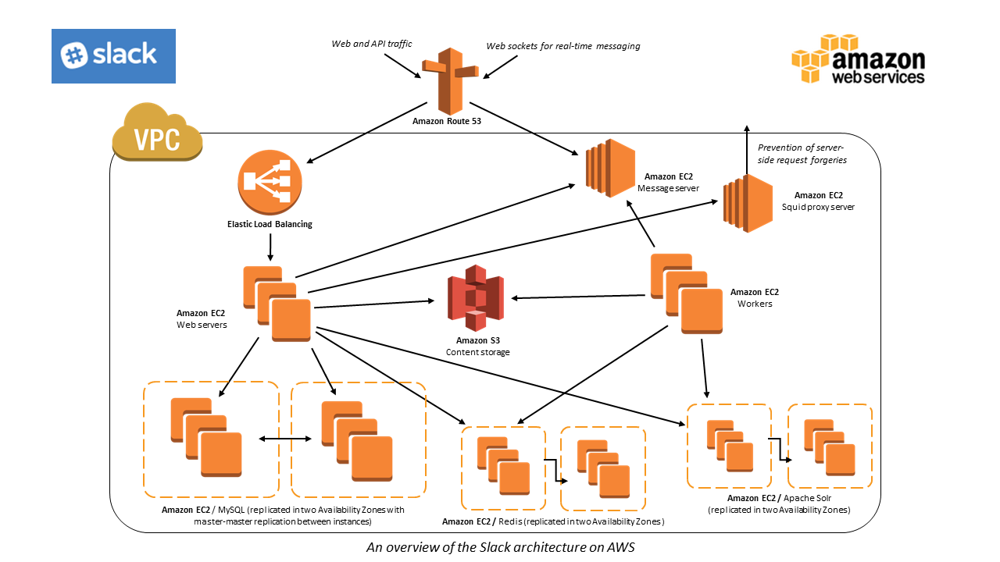

# General Course Logistics and Expectatations

## What is INFO 441 (Server-Side Development)?
 
#### Concepts Covered
- GoLang, Communication Protocols, REST, Web Services, Containerization, Cloud Services, Data Stores, Microservices, Asynchronous Messaging, Web Sockets, Concurrency, etc.

#### Building Full Stack Web Application
- Throughout this course, you'll be building a service similar to that of [Slack](https://slack.com/) (at least, at a basic level). You'll get to dive deeper into understanding how events from a client is processed and managed by a server. 

#### Why is this important?
- Regardless of what your endeavors are for you career in technology, it's always important to understand how things work. Perhaps not entirely, but to an extent. The goal of this course is to make you more curious about how large systems in our world currently operate. Ideally, we hope everyone walks away from this course, comfortable understanding the underlying architecture and processes, that are require of any major system. 
- Even though you're building a basic chat application, the fundamental concepts and technologies we will cover is utilized in almost all large systems. Systems like **Amazon**, **Dropbox**, **Uber** (just to name a few) all utilized the concepts we will cover.
- That being said, what you'll learn will also help you present yourself as a viable candidate when it comes to applying for internships or jobs.

## Course Logistics
- **Office Hours**: Held at MGH 440.

| Person      | Office Hours | Email | 
| ----------- | ----------- | ----------- |
| Ani   | **M** - 12:30 to 14:30 & **F** -  11:30 to 13:30|ask710@uw.edu|
| Bao      | **MW** - 13:30 to 15:30     |bdinh@uw.edu|

&nbsp;&nbsp;&nbsp;&nbsp; Dr.Nigini's office hours are set by appointment.

- **Communication**
  - Slack (for HW questions, concept clarification), Canvas Discussion (course logistics, policy), Email (grading)
- **Schedule**
  - 7 Assignments 1 Final Project (90% of grade)
    	- Each assignment builds on each other
    	- Due every Monday at midnight
    	- EC Options are not limited
  - 2 exercises per week (10% of grade)
    	- Must be present due to access code
    	- Due either ten minutes after class or midnight that night
- **Late Work**
  - 5 late days, 3 missed exercises
		- In general, assignments build on each other so don’t be late
  - 10% after late days are used, by default we won't use your late days unless specified by you in submission comments
  - Extenuating circumstances must be expressed through email with all staff
- **Grading**
  - 2 week turnaround
  - 1 week to fix mistakes for 50% of lost points (this helps us and you because errors cascade)
  - Regrades must be submitted via email with both of us cced
  - iSchool conversion chart.

## Expectations
- **Readings**
    - Do it
    - Do code alongs in tutorials if present
    - Due to the nature of lecture, please come prepared with questions. We’d be more than happy to answer them.
    - Be proactive and look for additional materials if the provided ones feel insufficient.
    - Please do it
- **Exercises**
  - Encourage to do it
  - Provide feedback to us
  - Submit link
- **Assignments**  
  - Commit early, commit often	
  - Submit PRs as well as Canvas submission
  - EC Options attempted should be in submission comments + pr description
  - Make sure service is always up and running unless we tell you to turn them off
  		- We will message you about this
  - Keep up with fixing mistakes (provided we give you feedback)
- **Coding Style**
  - Use stuff learned from CSE 142/143, INFO 201/343, etc. Few examples:
    	- Appropriate variable/function naming convention
    	- DRY (Don't Repeat Yourself) principle
    	- Split large amounts of code to smaller functions (Refactor)
  -  If you find a better way of doing something, do it.
- **Questions**
  - Reassess your code, one little bug can do wonders
  - In general, reread tutorials/readings
  - Do additional research on relevant topics
  - Then ask us questions
- **Communication on Slack**
  - Threads
  - Use general for questions as much as possible (so classmates can see answers to similar questions and you can get help faster)
  - Be as specific as possible with question, provide context
  - Format your messages, (code should not be sent as screenshot, errors can be screenshots)
  - Be mindful, we may not be able to answer your questions right away
  - We won’t be as active on the weekends
- **What are some expectations you have for us?**

## How to succeed?
- Do the readings assigned **before class** and follow any code alongs presented with the readings
- Do additional readings on your own if provided material isn't sufficient 
- **Show up to class and ask questions**
- Attend Office Hours 
- Make friends, use each other as a resource
- **Start assignments early**
- Don't fall behind on concepts 
- Break down assignment and estimate how long it'll take to do each section
- Aim to get as much done early so you can plan for questions
- Do extra credit

**Closing Notes:** This course demands a lot from you, but we promise it’ll be very rewarding. That being said, we are here to support you. Let’s have fun!

